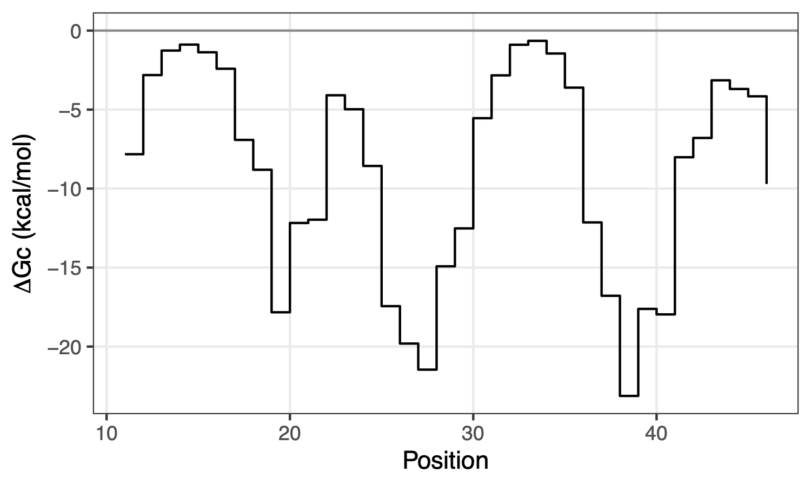
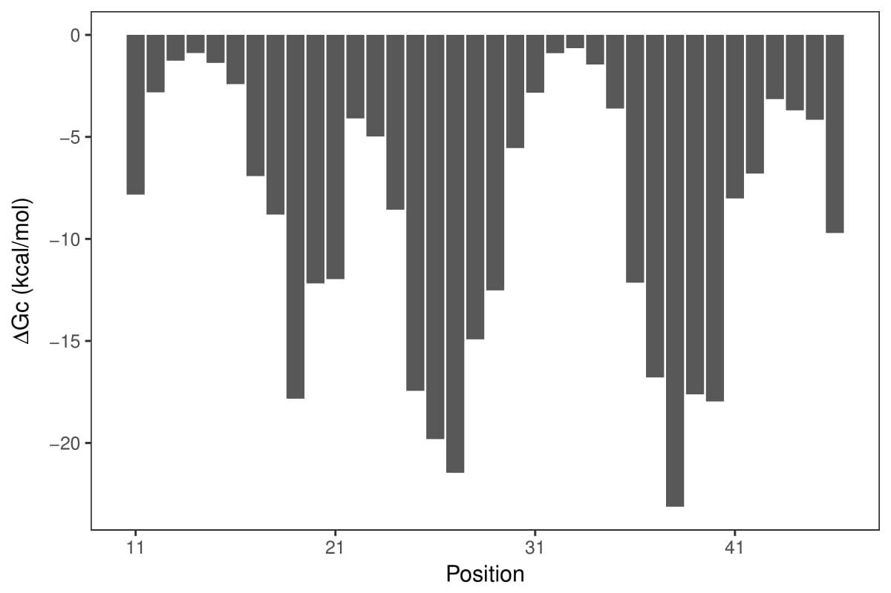
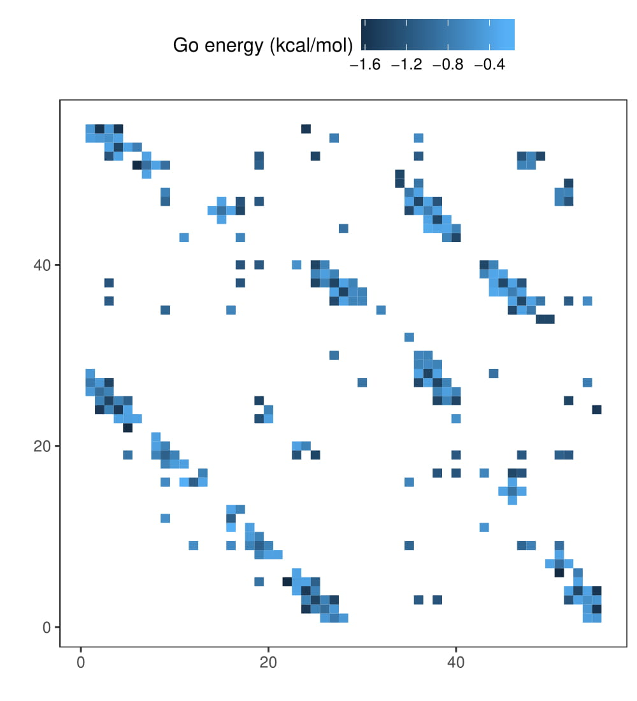

# TADOSS - TAndem DOmain Swap Stability predictor

[](LICENSE)

`TADOSS` estimates the stability of tandem domain swap conformations using an alchemical approximation based on coarse-grained (Go-like) simulation models from the three-dimensional structure of a protein domain.

The stability is defined as the relative free energy difference (`ΔΔG`) between the native and swap conformations of a pair of tandem identical domains. More information about the energetic model can be found [here](docs/energetic_model.pdf).

## Requirements

- `Python` 2.7: https://www.python.org/download/releases/2.7
- `BioPython`: http://biopython.org/wiki/Download
- One of the following two:
  - `GROMACS` 5.0 or higher: http://manual.gromacs.org/documentation
  - `Reduce`: http://kinemage.biochem.duke.edu/software/reduce.php

Other recommended software:
- `R` version 3.4 or higher https://www.r-project.org, including:
  - `ggplot2`
  - `optparse`
- Recommended molecular 3D viewers:
  - `PyMOL`: https://pymol.org/2
  - `Chimera`: https://www.cgl.ucsf.edu/chimera/download.html

## Installation

1. Make sure you have installed the required software and packages (see above).
2. Clone this repository to your desired location.
```bash
git clone git@github.com:lafita/tadoss.git ~/tadoss
```
3. Optional: add `tadoss` to your `PATH` (symlinks do not currently work).

## Usage

The method consist in four steps starting from a `PDB` file of a protein domain structure. 
We demonstrate the usage with the SH3 domain in `e1shgA1.pdb` as an example.

### Bundle script

In order to simplify the usage of the method, a `Bash` script that bundles the four steps steps is provided with a simple interface to the user.

```
~/tadoss/tadoss -d sh3 -f e1shgA1.pdb
```

### Steps

Each of the steps can also be run separately to allow more flexibility and control to the users.

1. Download and prepare the domain structure (ECOD domain `e1shgA1` as example):
```
# Under the example folder in this repository
cd example
mkdir tmp # temporary intermediate files will be stored here
```
```
# Select only protein residues from the structure
python2.7 ~/tadoss/trim_nonprotein.py e1shgA1.pdb tmp/sh3_protein.pdb
```

2. Add missing hydrogens to the structure:
```
# Using GROMACS
gmx pdb2gmx -f tmp/sh3_protein.pdb -o tmp/sh3_hadded.pdb -ignh <<< $'14\n3'
```
```
# Using Reduce (use the path to the "reduce" script)
reduce tmp/sh3_protein.pdb > tmp/sh3_hadded.pdb
```

3. Generate native contact energy (Go model) from the structure:
```
python2.7 ~/tadoss/go_builder/go_builder.py -k sh3 --gmx tmp/sh3_hadded.pdb
```

The generated native contact energies are listed in file `go_sh3/go_sh3_gomodel_golist.dat`.
Other files are not needed for domain swap stability estimation.

The first two columns of the file contain the pair of residues forming the contact (i,j), the third column contains their distance in Amstrongs and the last column is the absolute Go energy of the interaction in kcal/mol.

4. Alchemical domain swap stability estimation from the Go model contact energies:
```
python ~/tadoss/tadoss.py sh3 tmp/sh3_hadded.pdb
```
Use the `-h` (help) option to see all the available options, including linker and hinge lengths:


## Results

The results are split into the following table files:

- [sh3-dG_cut.tsv](example/sh3-dG_cut.tsv): with the length of hinge loops (`Lhinge`), the residue `position`, and the alchemical cut free energy (`dGcut`) representing the penalty of creating a hinge loop centered at the position.
- [sh3-dG_join.tsv](example/sh3-dG_join.tsv): with the free residues (without contacts) at the N and C termini (`free_N` and `free_C`), the distance (`dist_NC`) and angle (`angle_NC`) between the N and C termini, the length of the inter-domain linker as a parameter (`Llinker`), the `M` parameter and the alchemical free energy of connecting the termini (`dGjoin`).
- [sh3-ddG_tot.tsv](example/sh3-ddG_tot.tsv): with the `length` of the domain, the free energy of joining and cutting the domain (`dGjoin` and `max_dGc`) and the total alchemical free energy: `ddGtot = dGjoin + max_dGcut`.


## Visualization

In order to visualize the mapping of the alchemical free energy onto the native domain structure, a new `PDB` file [sh3-dG_cut.pdb](example/sh3-dG_cut.pdb) is generated with the `ΔGc` values in the B-factor column.
To take a look at it in `PyMOL`, open the structure and select `Action` > `preset` > `b factor putty` to obtain a representation like the one below:



In addition, two R scripts are provided to plot the free energy profile of the domain as a barplot and the Go contacts as a matrix.
Use the following commands:

```
Rscript ~/tadoss/dGc_profile.R -i sh3-dG_cut.tsv -o sh3-dG_cut.pdf
```



```
Rscript ~/tadoss/go_contacts.R -i go_sh3/go_sh3_gomodel_golist.dat -o sh3_go-contacts.pdf
```




## Publications

- Manuscript in preparation.
- Original description by Tian and Best (2016): https://doi.org/10.1371/journal.pcbi.1004933


## FAQ

#### What does a positive total alchemical free energy (ΔΔG) mean?

As defined by our model `ΔΔG = ΔG(native) - ΔG(swap)`, therefore a positive `ΔΔG` means that the domain swap conformation of the tandem domains is more stable than the native domains in tandem (non-swapped).
Analogously, the more negative the `ΔΔG`, the more stable the native conformation is relative to the domain swap.

#### Why are Go contact energies positive?

The file [go_sh3/go_sh3_gomodel_golist.dat](example/go_sh3/go_sh3_gomodel_golist.dat) contains the absolute value of the contact energies, in kcal/mol. 
The value of the Go energy is the negative of that.

#### How are the residue indices in the output files generated?

The residue positions in the output file [sh3-dG_cut.tsv](example/sh3-dG_cut.tsv) are the indices of the residues in the input structure. 
This indices are different from the residue numbers in the input PDB file and independent to the original amino acid sequence of the protein, i.e. they are only relating to the amino acids in the input structure and their sequential order.

